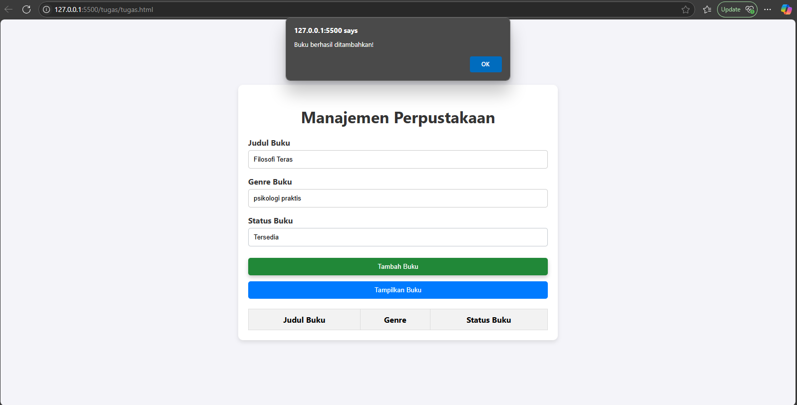
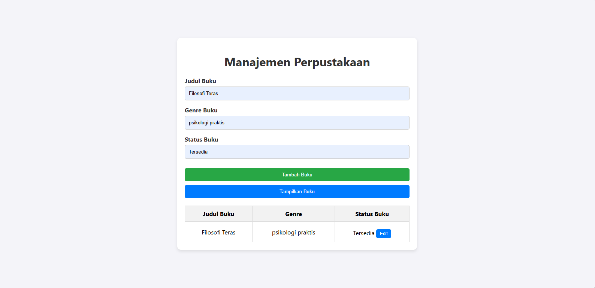
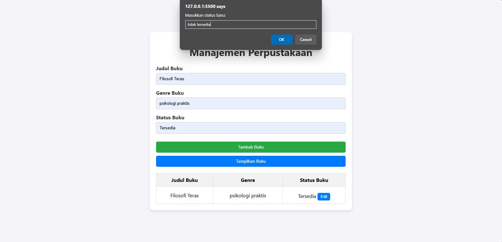
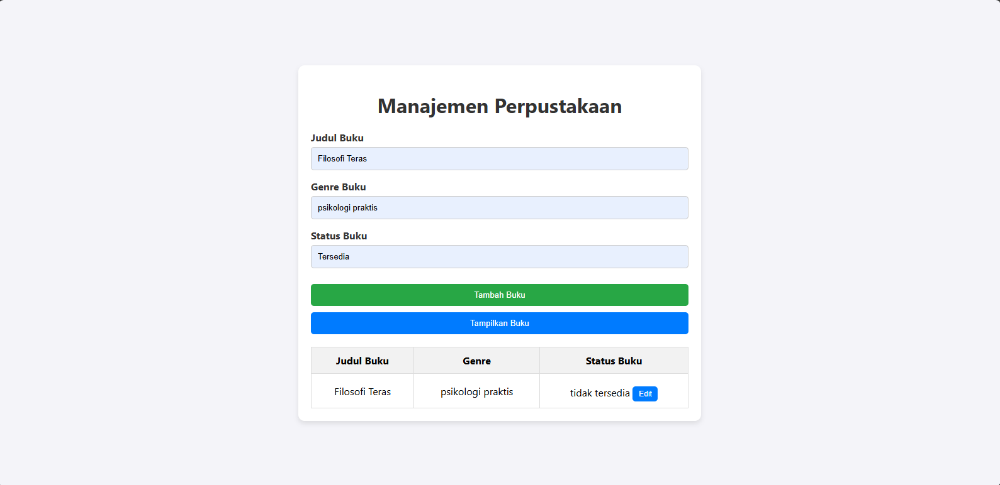

# Manajemen Perpustakaan

Proyek ini adalah aplikasi manajemen perpustakaan sederhana yang memungkinkan pengguna untuk menambahkan dan mengedit status buku.

## Cara Menjalankan

1. Pastikan Anda memiliki ekstensi [Live Server] terpasang di Visual Studio Code.
2. Buka folder proyek ini di Visual Studio Code.
3. Klik kanan pada file `tugas.html` dan pilih `Open with Live Server`.
4. Aplikasi akan terbuka di browser Anda dan siap digunakan.

## Struktur Proyek

- `tugas.html`: File HTML utama.
- `styles.css`: File CSS untuk styling.
- `scripts.js`: File JavaScript untuk logika aplikasi.

## Fitur

- Menambahkan buku baru dengan judul, genre, dan status.

- Menampilkan daftar buku dalam bentuk tabel.

- Mengedit status buku yang sudah ada.



## Konsep Pemrograman Berbasis Objek

Proyek ini menggunakan beberapa konsep pemrograman berbasis objek, termasuk:

- **Class dan Pewarisan**: Proyek ini memiliki kelas induk `Buku` dan dua kelas turunan `FictionBuku` dan `NonFictionBuku`.
- **Interaksi Objek**: Objek buku dibuat dan dimanipulasi melalui fungsi-fungsi seperti `addBuku` dan `editStatus`.
- **Getter dan Setter**: Properti privat `_status` diakses dan dimodifikasi menggunakan getter dan setter.

## Kode

### Menu Input

```html
<div class="form-group">
  <label for="Buku-title">Judul Buku</label>
  <input type="text" id="Buku-title" placeholder="Masukkan judul buku">
</div>

<div class="form-group">
  <label for="Buku-genre">Genre Buku</label>
  <input type="text" id="Buku-genre" placeholder="Masukkan genre buku">
</div>

<div class="form-group">
  <label for="Buku-status">Status Buku</label>
  <input type="text" id="Buku-status" placeholder="Masukkan status buku">
</div>

<button class="tambah" onclick="addBuku()">Tambah Buku</button>
<button class="tampil" onclick="showBukus()">Tampilkan Buku</button>
```

### Menu Edit

```javascript
function editStatus(index) {
  const newStatus = prompt("Masukkan status baru:");
  if (newStatus) {
    Bukus[index].updateStatus = newStatus;
    showBukus();
  }
}
```

### Fitur Menampilkan Daftar Buku

```javascript
function showBukus() {
  const BukuList = document.getElementById("BukuList");
  BukuList.innerHTML = '';

  Bukus.forEach((Buku, index) => {
    BukuList.innerHTML += `
      <tr>
        <td>${Buku.title}</td>
        <td>${Buku.genre}</td>
        <td>${Buku.status} <button class="edit-button" onclick="editStatus(${index})">Edit</button></td>
      </tr>
    `;
  });
}